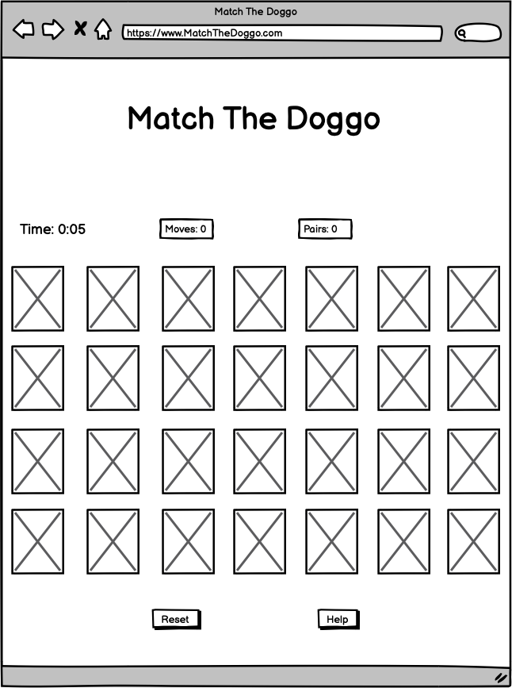

# Match The Doggo

Match The Doggo is memory game that is designed for all ages. The instrutins are super easy to follow and the game helps with improving focus and memory and most importantly, the game is designed to have fun with its replayability!

A deployed link is available [here.](https://joshfreeman00.github.io/MatchTheDoggo/)

## Showcase

## UX

## Goals

The goal for this project is to create a pair matching game that is both interactive for the user as well as user-friendly.

### User:

As a user I want the game to include;

* A fun and engaging experience.
* Randomisation to increase longevity.
* Instructions on how to play.
* Colours that are subtle and attractive that have a theme and are not too distracting from the game.
* A timer to show how fast I can complete said game.
* A counter for the amount of moves I have completed and the amount of pairs I have.

### Game Developer:

As a games developer I want;

* The game to be fun and unique every new game, no repetitiveness.
* The game to include instructions on how to play.
* The game to be simple and easy to play.
* To include a timer.
* To include a score and total moves.

## Features

### Key features

* Be able to match the dogs.
* A timer to show the time taken to complete the game.
* Keep track of their game score and total moves.
* Instructions modal on how to play.

## Structure

* Entering the website takes you to the homepage, where the user can see the title, a welcome sentence and instructions on how to play.
* Underneath the instructions is a button that takes you to the game page itself.
* The game page includes:
  - 12 cards, with 6 pairs.
  - A timer in the top left of the page.
  - A reset button underneath the cards that resets the scores and randomises the cards, also resets timer.
  - A help button underneath the cards that once clicked, an modal pops up with instructions.
  - A score of the amount of moves the user has done and the amount of pairs, just above the cards.
* Game cards that flip when clicked on, just like in real life.

### Home page

#### Title

* The name of the website is located at the top of the page, along with a welcoming sentence.
  - Both on the home page and game page, the title has the abiltiy of returning to the home page just by clicking on it.

#### Instructions

* The main focus of the page is to give instructions to the user of how to play the game.

#### Ready to play? button

* Underneath the instructions is a button that takes you to the game page.

### Game page 

#### Title

* Again the name of the website is located at the top of the page
  - Both on the home page and game page, the title has the abiltiy of returning to the home page just by clicking on it.

* There are two buttons, home and how to play.
  - The home button allows the user to go to the home page.
  - The how to play button, once clicked, allows the user to read the instructions of the game.

### Game area

* At the top of the game area are the stats that consist of the time, moves taken and pairs found.

* The main focus of this page is the cards, this is the game itself, consisting of 12 cards.

* Underneath the cards is the two buttons for the game, play and reset.
  - The play button starts the game, it allows the user to interact with the cards and also starts the timer.
  - The reset button resets the games progress by reloading the page.

## Design

### Images

The images used are relevant to the games context.

* The 6 photos of dogs are used for the front of the cards, which is the main focus of the game.
* The image of the paw prints is used for the back of the cards and is relevant to the game.

### Colour scheme

* The colour scheme of the game is green and white, these two colours provide excellent contrast and porvides a feel of nature and harmony throughout.

### Font

* The font used throughout the website is Fredoka. A fullback font of Sans-Serif is used just in case for whatever reason is that the font isn't loaded correctly.
  - The link to link to the font Fredoka can be found [here.](https://fonts.google.com/specimen/Fredoka?query=fredoka)

## Wireframes

The wireframes for the Game can be viewed here.

* index.html

* index.html (mobile)

* game.html

* game.html (mobile)

* Modal

## Languages

* [HTML5](https://en.wikipedia.org/wiki/HTML5)
* [CSS](https://en.wikipedia.org/wiki/CSS)
* [JavaScript](https://en.wikipedia.org/wiki/JavaScript)

## Tools

* [Gitpod](https://www.gitpod.io/) - Used as a cloud-based IDE.
* [Github](https://github.com/) - Used to secure code online.
* [Git](https://git-scm.com/) - Version control.
* [Balsamiq](https://balsamiq.com/) - Used to create wireframes.
* [Google Fonts](https://fonts.google.com/) - For the font that was used.
* [Bootstrap](https://getbootstrap.com/docs/5.2/getting-started/introduction/) - For the grid system and buttons.
* Google Chrome Dev tools - for proofreading code.
* [Am I Responsive?](https://ui.dev/amiresponsive) - To see the responsiveness of the website on multiple devices.
* [WebAIM](https://webaim.org/resources/contrastchecker/#:~:text=WCAG%202.0%20level%20AA%20requires,such%20as%20form%20input%20borders) - Used to check the contrast between foreground and background colours.

## Testing

To view all testing documentation, click [here.](TESTING.md)

## Deployment

The site was deployed to GitHub pages. The steps to deploy are as follows: 
  - In the [GitHub repository](https://joshfreeman00.github.io/MatchTheDoggo/), navigate to the Settings tab 
  - From the source section drop-down menu, select the **Main** Branch, then click "Save".
  - The page will be automatically refreshed with a detailed ribbon display to indicate the successful deployment.

The live link can be found [here](https://joshfreeman00.github.io/MatchTheDoggo/)

### Local Deployment

In order to make a local copy of this project, you can clone it. In your IDE Terminal, type the following command to clone my repository:

- `git clone https://github.com/joshfreeman00/MatchTheDoggo.git`

Alternatively, if using Gitpod, you can click below to create your own workspace using this repository.

## Credits

* [Bootstrap v5.2](https://getbootstrap.com/docs/5.2/getting-started/introduction/) - The grid system.
* [Google Fonts](https://fonts.google.com/) - For the Fredoka font that was used.
* [w3schools](https://www.w3schools.com/default.asp) - For the consistent help throughout.
  - Help with the modal can be found [here.](https://www.w3schools.com/howto/howto_css_modals.asp)
* [Stack Overflow](https://stackoverflow.com/) - For help debugging and fixes throughout.
  - The code for testing the restart button can be found [here.](https://stackoverflow.com/questions/55712640/jest-testing-window-location-reload)
* My mentor - For helpful tips and debugging.
* [Unsplash](https://unsplash.com/) - The images used for the cards within the game were sourced from here.
 - Image for dog2 can be found [here.](https://unsplash.com/photos/JNm1dAElVtE)
 - Image for dog3 can be found [here.](https://unsplash.com/photos/5Vr_RVPfbMI)
 - Image for dog4 can be found [here.](https://unsplash.com/photos/Qb7D1xw28Co)
 - Image for dog5 can be found [here.](https://unsplash.com/photos/k1LNP6dnyAE)
 - Image for dog6 can be found [here.](https://unsplash.com/photos/Mv9hjnEUHR4)
 - Image for dog7 can be found [here.](https://unsplash.com/photos/brFsZ7qszSY)
* [pngset] - The image for the back of the card can be found [here.](https://pngset.com/download-free-png-kooct)
* [tinloof.com](https://tinloof.com/blog/how-to-build-a-stopwatch-with-html-css-js-react-part-2) - Fundemental code for the timer.
* [Marina Ferreira](https://marina-ferreira.github.io/tutorials/js/memory-game/) - Fundemental code for flipping cards animation.

## Acknowledgements

* To create this game, I used material and information covered in the Full Stack Development course by Code Institute. As well as information from the Slack Community Channels, Stack Overflow and W3Schools.

* Tim Nelson, my mentor, for reviewing my work and providing useful, help, feedback and advice throughout.