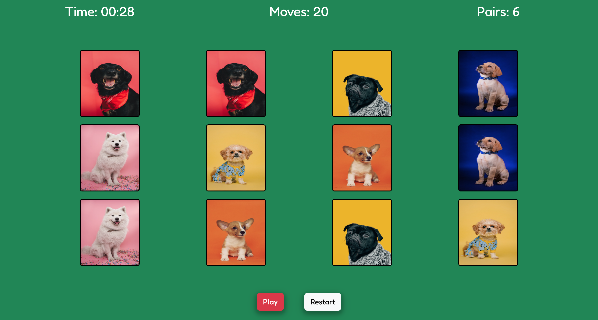
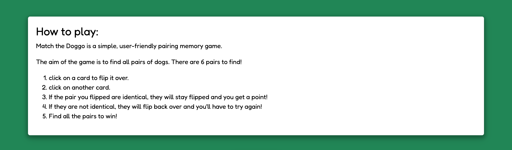

# Testing

To return to the readme click [here.](README.md)

## Code validation

### HTML validation

- Validation for index.html can be found [here.](https://validator.w3.org/nu/?doc=https%3A%2F%2Fjoshfreeman00.github.io%2FMatchTheDoggo%2Findex.html)

- Validation for game.html can be found [here.](https://validator.w3.org/nu/?doc=https%3A%2F%2Fjoshfreeman00.github.io%2FMatchTheDoggo%2Fgame.html)

- Disclaimer: Both warnings shown are to do with section elements not containing any h elements (e.g h1), this was brought up with my mentor and was deemed fine to submit.

### CSS validation

- Validation for the CSS can be found [here.](https://jigsaw.w3.org/css-validator/validator?uri=https%3A%2F%2Fjoshfreeman00.github.io%2FMatchTheDoggo&profile=css3svg&usermedium=all&warning=1&vextwarning=&lang=en)

- Note: Any errors/warnings that are shown is to do with Bootstrap. If the CSS code is entered via direct input, there will be no errors, as show below.

### JS validation

- Validation for the JS can be found [here.](https://jshint.com/)

## Responsiveness

* The following images will showcase how the game is shown on different devices and shows the responsiveness of the game.

- Mobile devices

    

    

- Tablet devices

    

    

- Desktop devices

    

    

## Browser Compatibility

* The following images show the game being tested in both Chrome and Safari browsers.

- Chrome

    

- Safari

    

## JEST testing

- I fully acknowledge and understand that, in a real-world scenario, an extensive set of Jest tests would be more comprehensive.

## User story testing

* A fun and engaging experience while helping to improve my focus, attention and my memory skills.
    - The game does this by timing the user and using a moves counter to track the score of the user. leaving the desire to beat their current score. Completing the game fast helps improve the users reactions and focus.

* Randomisation to increase longevity.
* The game to be fun and unique every new game, no repetitiveness.
    - This is achieved by shuffling the cards when the page loads and every time the game is reset.

* Instructions on how to play.
* The game to include instructions on how to play.
* The game to be simple and easy to play.
    - Both on the home page and by clicking the 'How to play' button, the user can see and read the instructions on how to play.
    - The games instructions being simple and not complicated, they are easy to follow.

* Colours that are subtle and attractive that have a theme and are not too distracting from the game.
    - Utilising a colour theme that has a high contrast accessibility rating, text and images are easy to read/see.
    - The use of having a solid colour as a back-ground doesn't distract the user so they do not lose focus while playing the game.

* A timer to show how fast I can complete said game.
* To include a timer.
    - A timer has been implemented to see how fast the user can finish the game, this brings enjoyment to user as it gives a challenge to beat their previous times.
    - The timer starts once the 'play' button has been clicked, the timer stops once the last pair has been found.

* A counter for the amount of moves I have completed and the amount of pairs I have.
* To include a score and total moves.
    - A moves counter has been implemented to track the amount of moves a user has used to complete the game, like the timer, it also bring enjoyment as they can try beat their score by winning with fewer moves.
    - A pairs counter has also been included to keep the user informed with the amount of pairs they currently have.

* A restart button to reset the game if required.
    - A restart button has been added next to the play button for user ease, if the user would like to restart the game and shuffle the cards, it can be done so by clicking the 'restart' button.
    - Once the restart has been clicked, a modal will pop up making sure the user would like to restart the game. The user can then proceed with restarting the game by clicking 'Yes' or the user can close the modal and continue by clicking the 'Close' button.

* The game does not start until the play button is clicked.
    - The game has been developed so that the cards cannot be interacted with until the 'play' button has been clicked. This is required every time the game has either loaded or restarted.
    - As well as the card being inactive, the timer does not start until the 'play' button is also clicked.

* Accessibility for mobile and tablet devices.
* The game to be functional on both mobile and tablet devices.
    - This is achieved by using media queries, altering the style of select elements to suit the resolution of both mobile and tablet devices.

## Environment testing

* The following images are within two seperate environments, they have different URLs to validate this.

### Local environment

* The images below show the game within the local (development) environment of gitpod.

- index.html

- game.html

### Production environment

* The images below show the game within the production (deployed) environment of github pages.

- index.html

- game.html

## Bugs

* ~~Theres was a bug that wouldn't allow the shuffling function to shuffle the cards in the pool all together.~~ This was fixed by removing the unnecessary bootstrap rows so that all cards were within the same parent element (row).

### Unfixed bugs

* There are no unfixed bugs that I am currently aware of.